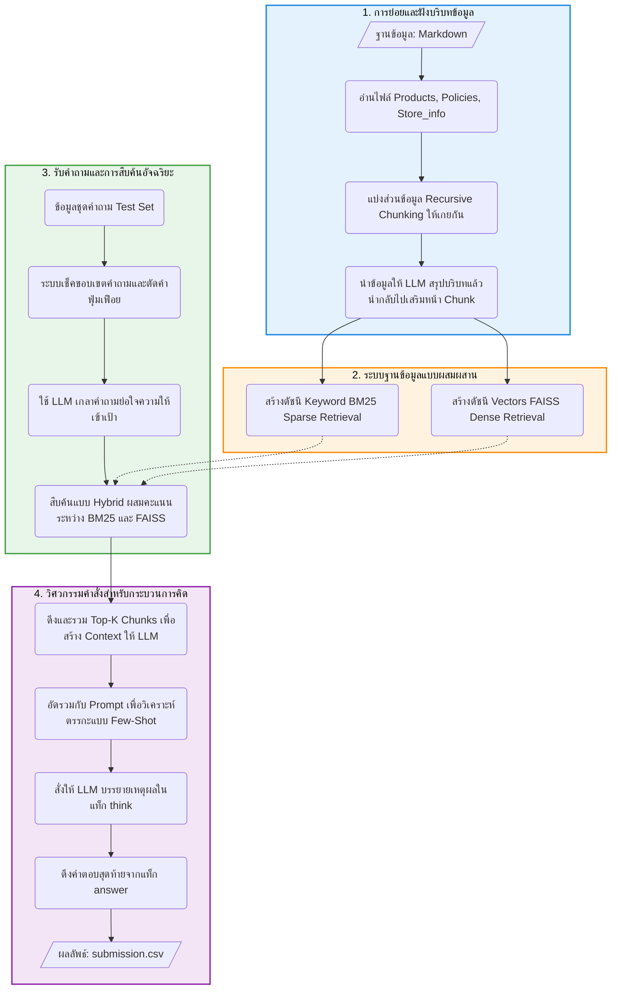

# 🚀 ระบบคำถาม-คำตอบ (RAG) สำหรับคลังสินค้าอิเล็กทรอนิกส์

โปรเจกต์นี้เป็นการนำเสนอสถาปัตยกรรม Retrieval-Augmented Generation (RAG) ขั้นสูง เพื่อการค้นหาและตอบคำถามเกี่ยวกับข้อมูลสินค้า นโยบายร้านค้า และข้อมูลทั่วไปของร้าน "ฟ้าใหม่" (FahMai) โดยมีจุดมุ่งหมายเพื่อวิเคราะห์และตอบคำถามแบบตัวเลือก (Multiple Choice) ได้อย่างมีประสิทธิภาพ

## 🗺️ สถาปัตยกรรมระบบ (System Architecture Flowchart)

Flowchart ด้านล่างแสดงกระบวนการทำงานและภาพรวมของระบบทั้งหมด ตั้งแต่ขั้นตอนจัดการและย่อยข้อมูลเอกสาร การสืบค้น ไปจนถึงขั้นตอนการสร้างคำตอบด้วยการให้เหตุผลผ่านโมเดลภาษา (LLM) ในรูปแบบ Chain-of-Thought:

## 🛠️ สรุปรายละเอียดกระบวนการทำ RAG ทีละขั้นตอน

กระบวนการภายใน Jupyter Notebook แบ่งการทำงานออกเป็น **7 ขั้นตอนหลัก** ดังนี้:

### **1. ฐานรากและการเชื่อมต่อ (Infrastructure & LLM Connectivity)**
* นำเข้าและติดตั้งชุดคลังซอฟต์แวร์ที่สำคัญ (Dependency Setup) เช่น `faiss-cpu`, `sentence-transformers`, `rank_bm25`, `pythainlp`
* กำหนดจุดเชื่อมต่อ API ไปยังบริการ **ThaiLLM** (โมเดล OpenThaiGPT) เพื่อดึงศักยภาพโมเดลพรีเทรนระดับภูมิภาค พร้อมด้วยกลไกอัจฉริยะในการ Retry และจัดการกับ Rate Limit ด้วยความแม่นยำสูง

### **2. การสับย่อยเอกสาร (Document Ingestion & Multi-level Chunking)**
* โหลดฐานความรู้เดิมที่เป็นเอกสาร Markdown (Products, Policies, Store_info) เข้ามาในระบบ
* ทำการหั่นเอกสารออกเป็นชิ้นย่อยด้วยขนาด Token `chunk_size` = 800 และเกยกัน (Overlap) = 150 ผ่านเครื่องมือ `RecursiveCharacterTextSplitter` เพื่อป้องกันเนื้อหาขาดออกจากกัน รวมถึงมีการฝัง "ชื่อและหมวดหมู่ของเอกสารต้นทาง" เข้าไว้ในระดับหัวบรรทัดด้วย

### **3. การฝังบริบทเพื่ออุดช่องโหว่ (Contextual Retrieval Augmentation)**
* **ประเด็น:** การสับเอกสารเป็นชิ้นเล็กๆ ย่อมเปิดโอกาสให้ชิ้นข้อมูลขาดบริบทที่มา (ประโยคลอยๆ) ส่งผลร้ายต่อระบบคำค้นและการทำ Vector 
* **เทคนิคพิเศษ:** สั่งให้ LLM มาอ่านเนื้อความของ "เอกสารแม่" พร้อมเปรียบเทียบกับ "ชิ้นข้อมูลย่อยแผ่นที่ 1" แล้วให้ตัว LLM สรุปว่าข้อมูลย่อยแผ่นนี้กำลังกล่าวถึงสินค้าใด จุดเด่นหลักอะไร แล้วนำประโยคสรุปบริบทนี้ *เติมเข้าไปหน้าชิ้นข้อมูลย่อยทุกๆ ชิ้น* 
* บันทึกสถานะการรันผ่านระบบ Cache (`contextual_chunks.json`)

### **4. เครือข่ายการสืบค้นผสมผสานแบบคู่ขนาน (Hybrid Store Architecture)**
* จัดสร้างระบบ Index สองทิศทางเพื่อประสิทธิภาพสูงสุด
    * ทิศทางที่ 1 **Faiss IP Index (Dense):** เปลี่ยนข้อมูลชิ้นย่อยเป็นเวกเตอร์ฝังลึกด้วยสมอง `intfloat/multilingual-e5-large-instruct` ทำหน้าที่รับผิดชอบโครงสร้างเชิงความหมายและบริบทประโยค
    * ทิศทางที่ 2 **BM25 Index (Sparse):** รับผิดชอบโครงสร้างเชิงคำศัพท์ (Keywords Match) โดยใช้ระบบตัดคำของ `pythainlp (newmm)`

### **5. กลไกการเกลาคำถามทิ้งน้ำกาก (Adaptive Query Refinement)**
* รับข้อความชุดคำถาม (Test Set) จากที่ผู้ใช้เล่าเรื่องฟุ่มเฟือยมา ระบบจะมี 2 ขั้นตอนป้องกัน:
    1. ตรวจับคำสั่งที่หลุดโลกหรือนอกขอบเขตร้าน (Out of scope keywords) ทันที
    2. ใช้ LLM อ่านประโยคคำถามเดิมที่ยาวเหยียด จากนั้นสั่งเขียนสรุปคำถามให้รัดกุมตรงประเด็นเพื่อลด Noise ที่จะรบกวนกระบวนการสืบค้นข้อมูล

### **6. การกรองและผสานเทคนิคคำค้น (Retrieval Orchestration)**
* นำคำถามที่เกลาแล้ว (และคำถามที่หักลบ Noise words ออกเฉพาะสำหรับ Sparse) พุ่งไปชนในระบบดัชนี 
* ทำการ Normalize (ปรับฐานคะแนนให้เป็น 0 ถึง 1) ระหว่างคะแนนจากของระบบ Vector Search และ Keyword Match ในอัตรา 50:50 
* ซึ่งจะได้ Top-K ก้อนปริมาณข้อมูลเอกสารที่มีความน่าจะเป็นและความใกล้เคียงสูงที่สุด จัดเรียงตามลำดับสำหรับนำไปมอบให้ LLM สร้างบทสรุป

### **7. พลังการวิเคราะห์เหตุผลและสรุปสุดท้าย (Prompt Engineering & Chain-of-Thought)**
* ลำตัวบริบทที่ดึงมาจากขั้นตอนดัชนีทั้งหมด จะถูกหลอมรวมให้สัมพันธ์กับการรันประมวลผลข้อสอบ (MCQ Options 1-10) ภายใต้สิทธิ์ Token ไม่ให้เกิน 6000 Token
* **หลักการวิศวกรรมคำสั่ง (Prompt Engineering):** ตัวระบบป้อนคำสั่งแบบเข้มแข็งและแนบตรรกะแบบสมมติให้ดูเป็นก้อนๆ (Mega Few-shot pattern) เช่น การพิจารณาอัตราค่าขนส่งน้ำหนักเกิน หรือค่าขนส่งบนอาคารที่ไม่มีลิฟต์
* **กรอบความนึกคิด (Chain-Of-Thought):** เคร่งครัดให้ LLM ทำการอธิบายและเชื่อมโยงเหตุผลที่คิดอยู่ในส่วนหน้าก่อนภายใต้แท็ก `<think>...</think>` ย่อยตรรกะคิดเองจนกว่าจะมั่นใจแล้วจึงส่งคำตอบออกมาเป็นเลขตัวเลือกสุดท้ายภายในพารามิเตอร์ `<answer>...</answer>` 
* ตรวจจับตัวเลขและส่งออกลงใบงาน `submission.csv` ได้ครบสมบูรณ์
